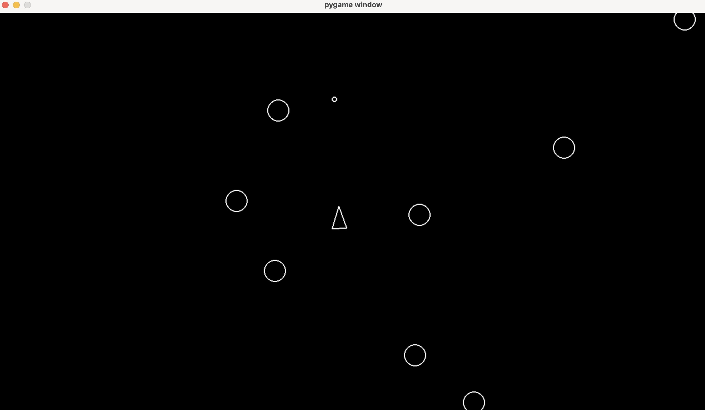

# 🪐 Asteroids game

A Python/Pygame remake of the classic arcade shooter. Destroy asteroids, avoid deadly collisions, and survive in space with responsive 2D movement and tight collision mechanics.



---

## 🚀 Features

* 🛸 Player-controlled spaceship with rotation and thrust-based movement
* 🪐 Randomly moving asteroids that wrap around the screen
* 💥 Bullet firing mechanics to destroy asteroids
* 🎯 Basic collision detection between bullets and asteroids

---

## 🧠 Tech Stack

* **Language:** Python 3.13.3 
* **Library:** [Pygame](https://www.pygame.org/)  
* **Assets:** Custom shapes (no external images used)

---

## 📦 Installation

```bash
# Clone the repository
git clone https://github.com/phanatcha/asteroids.git
cd asteroids-clone

# (Optional) create a virtual environment
python -m venv venv
source venv/bin/activate  # on Windows: venv\Scripts\activate

# Install dependencies
pip install -r requirements.txt
```

---

## ▶️ How to Play

```bash
python main.py
```
| Key    | Action                         |
|--------|--------------------------------|
| A / D  | Rotate the ship left/right     |
| W      | Thrust forward (move forward)  |
| S      | Reverse thrust (move backward) |
| SPACE  | Shoot bullets                  |

---

## 🧩 Code Structure
```bash
asteroids/
│
├── asteroid.py
├── asteroidfield.py
├── circleshape.py
├── constants.py
├── main.py
├── player.py
├── shot.py
```

---